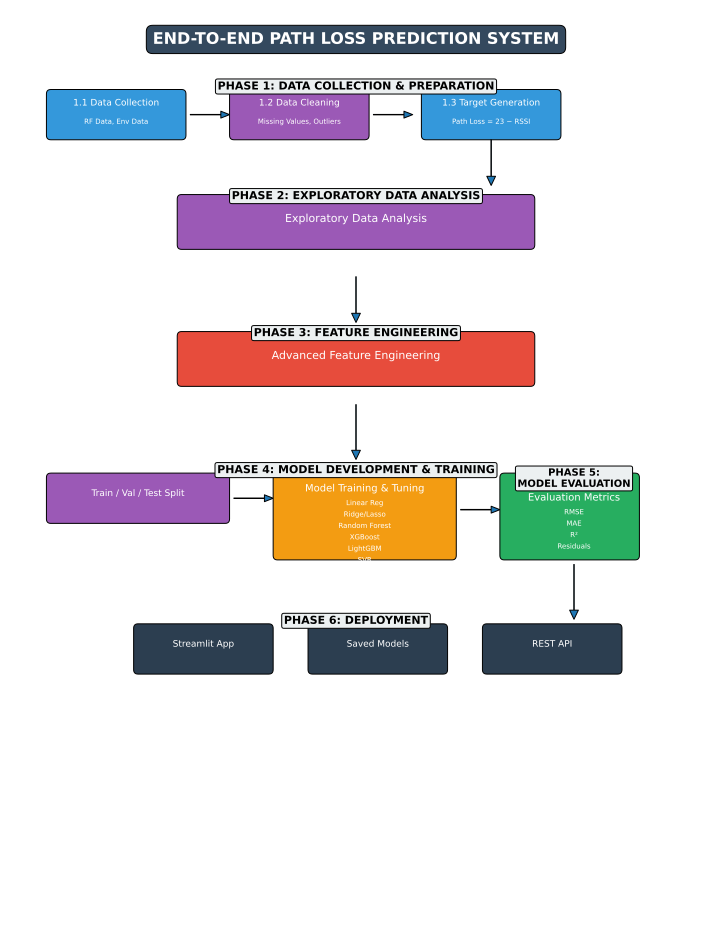

# 📡 End-to-End Path Loss Prediction Using Machine Learning (RF / 5G)

This project implements a **complete machine learning pipeline** to predict **path loss in RF / cellular communication environments** using real-world network measurement data.  
The system models how signal strength degrades due to distance, environment, and network conditions, and compares multiple ML algorithms to identify the best-performing model.

---

## 🎯 Project Objectives

- Generate a realistic **path loss target variable** from received signal strength  
- Perform **exploratory data analysis (EDA)** and **time-series analysis**
- Apply **feature engineering & preprocessing**
- Train and compare **multiple regression models**
- Evaluate performance using **RMSE, MAE, and R²**
- Visualize results using **professional plots**
- Save models and preprocessing artifacts for reuse
- Provide an optional **Streamlit interface** for inference

---

## 📂 Dataset Overview

The dataset represents **cellular / RF communication measurements** collected over time.

### Key Features Used

| Feature | Description |
|------|------------|
| Timestamp | Time of measurement |
| Signal Strength (dBm) | Received signal power |
| SNR | Signal-to-Noise Ratio |
| Call Duration (s) | Duration of call |
| Environment | Urban / Suburban / Home / Open |
| Attenuation | Estimated environmental loss |
| Distance to Tower (km) | Distance from base station |
| Tower ID | Cellular tower identifier |
| User ID | User identifier |
| Call Type | Voice / Data |

### 🎯 Target Variable

**Path Loss (dB)** is generated using RF principles:
Path Loss (dB) = Transmitted Power (assumed constant) − Received Signal Strength (dBm)

This allows the ML models to learn **signal degradation behavior** under varying conditions.

---

## 📄 Sample Training Data

| Timestamp | Signal Strength (dBm) | SNR | Call Duration | Environment | Attenuation | Distance (km) | Call Type |
|---------|----------------------|-----|---------------|-------------|-------------|---------------|-----------|
| 01-03-2024 17:46 | -84.11 | 25.94 | 1713.8 | Urban | 14.69 | 2.24 | Data |
| 01-04-2024 17:29 | -87.80 | 15.93 | 345.37 | Home | 6.21 | 5.00 | Voice |
| 01-05-2024 17:14 | -116.57 | 14.70 | 259.28 | Open | 4.49 | 8.70 | Voice |

Full dataset: **Train Data.csv**

---

## 🧠 Machine Learning Models Implemented

The following regression models were trained and compared:

- Linear Regression  
- Ridge Regression  
- LASSO Regression  
- Elastic Net  
- Random Forest Regressor  
- Gradient Boosting Regressor  
- XGBoost Regressor  
- LightGBM Regressor  
- Support Vector Regressor (SVR)

**Hyperparameter tuning** was performed using **RandomizedSearchCV** with cross-validation.

---

## ⚙️ ML Pipeline

1. Data Loading  
2. Data Cleaning & Imputation  
3. Target (Path Loss) Generation  
4. Exploratory Data Analysis  
5. Feature Engineering  
6. Train / Validation / Test Split  
7. Model Training & Hyperparameter Tuning  
8. Model Evaluation & Comparison  
9. Visualization & Interpretation  
10. Model & Preprocessor Serialization  

---

## 📊 Visual Results

### 🔹 Dataset Analysis

### 🔹 Feature Correlation Matrix

### 🔹 Model Performance Comparison

### 🔹 Prediction Error Analysis

### 🔹 Time Series Analysis

### 🔹 Process Flow Diagram

---

## 📈 Evaluation Metrics

Each model was evaluated using:

- **RMSE** – Penalizes large prediction errors  
- **MAE** – Average absolute error  
- **R² Score** – Variance explained by the model  

These metrics help identify **accuracy, robustness, and generalization ability**.

---

## 🗂️ Project Structure

PATH_LOSS_PREDICTION/ │ ├── artifacts/ │ ├── all_best_models/ │ ├── best_model.joblib │ ├── feature_info.joblib │ ├── model_performance_results.xlsx │ └── preprocessor.joblib │ ├── rf_env/ # Virtual environment ├── path_loss_prediction.ipynb # Main experiment notebook ├── streamlit_app.py # Optional UI ├── Train Data.csv ├── Dataset Analysis.png ├── Feature Correlation Matrix.png ├── Model Performance Comparison.png ├── Predictions Error Analysis.png ├── Time Series Analysis.png ├── Process Flow diagram.png ├── process_flow_diagram.svg ├── requirements.txt └── readme.md

---

## 🖥️ Streamlit Application Features

The Streamlit application supports two prediction modes:

### 🔹 Single Prediction
Users can manually enter RF and environmental parameters such as:
- Signal strength
- Distance to tower
- Environment type
- Attenuation and SNR

The system predicts the corresponding **path loss value in real time**.

### 🔹 Batch Prediction
Users can upload a CSV file containing multiple samples.
- The model performs predictions for all rows
- Output is displayed as a table
- Predicted results can be downloaded as a CSV file

This enables efficient evaluation of large datasets.

Run locally: streamlit run streamlit_app.py

---

## 🧪 Key Observations

- Tree-based models (Random Forest, XGBoost, LightGBM) outperform linear models
- Distance and signal strength dominate path loss prediction
- Environmental factors introduce non-linear effects
- Feature engineering significantly improves performance

---

## 🔮 Future Scope

- Deep learning models (ANN, LSTM)
- Comparison with **3GPP theoretical path loss models**
- Real-time streaming inference
- REST API deployment
- Geospatial modeling using coordinates

---

## 📌 Usage & Applicability

This project demonstrates practical machine learning skills applied to real-world RF and telecom data.  
It is suitable for:
- Academic research and learning
- AI/ML portfolio and resume projects
- Applied data science and regression modeling use cases